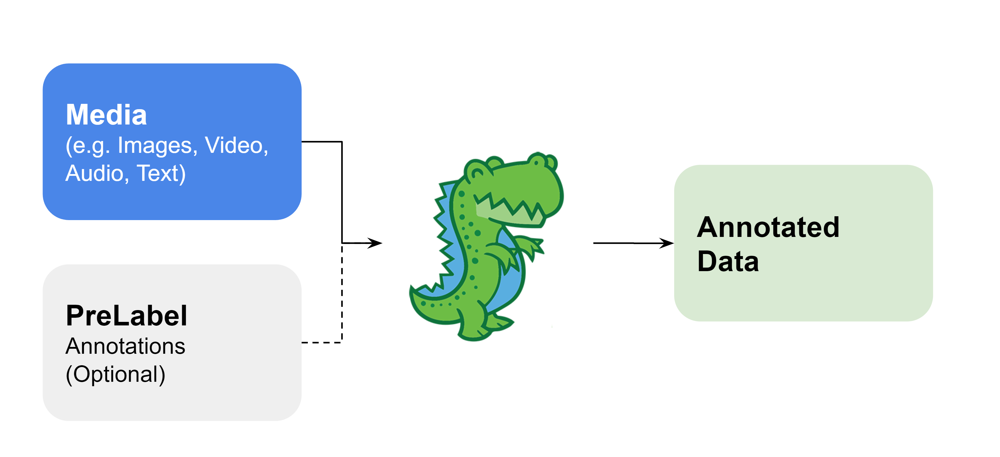
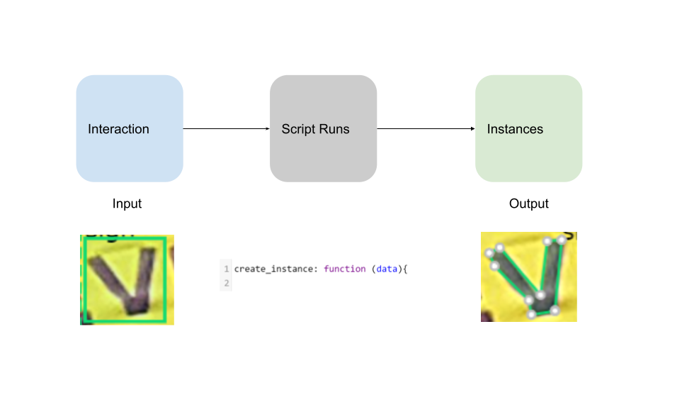
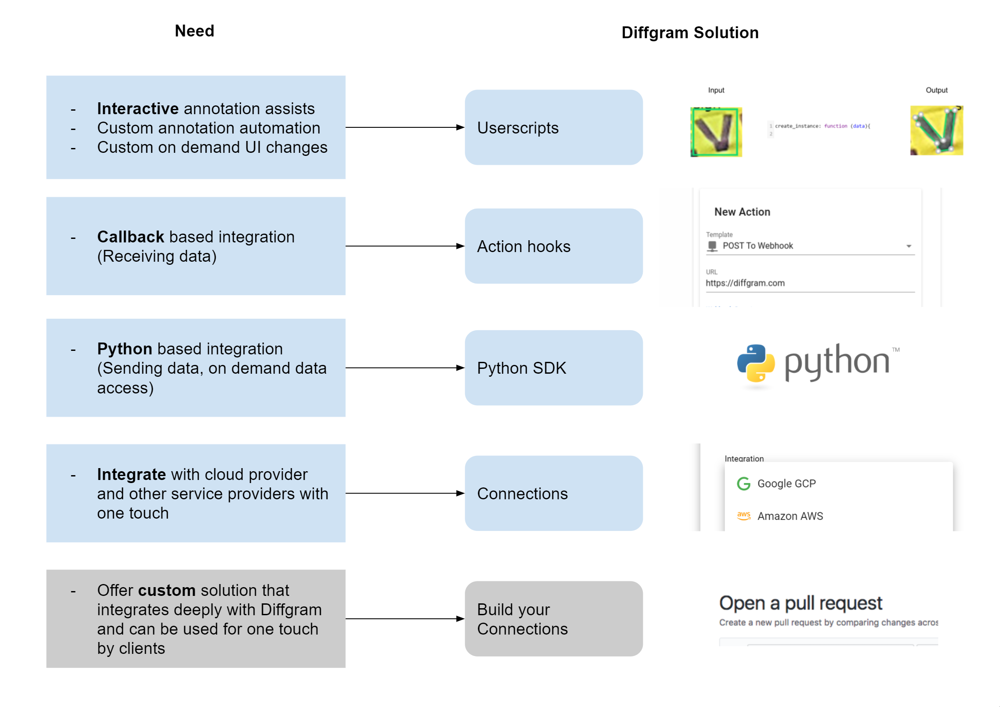

# Diffgram - Supervised Learning Data Platform



Diffgram is annotation and training data software.

# Quickstart

[Try Diffgram Online](https://diffgram.com/user/data_platform/new)

### Diffgram Dev Installer Quickstart
Requires Docker and Docker Compose
```
git clone https://github.com/diffgram/diffgram.git
cd diffgram
python install.py
# Follow the installer instruction and 
# After install:  View the Web UI at: http://localhost:8085
```
[Development Install Docs](https://diffgram.readme.io/docs/quickstart-installation-of-diffgram-open-core)
<br/>
[Production Install Docs](https://diffgram.readme.io/docs/open-installation-production)
<br/>
[Helm Chart](https://github.com/diffgram/diffgram-helm)

# Benefits
1. Flexible deploy and many integrations - run Diffgram anywhere in the way you want.
2. Scale every aspect - from volume of data, to number of supervisors, to ML speed up approaches.
3. Fully featured - 'batteries included'.

# Docs
### [Docs](https://diffgram.readme.io/docs)
* [Getting Started Plan](https://diffgram.readme.io/docs/getting-started-plan)
* [Videos](https://www.youtube.com/channel/UC4ZVmvMA6oa3Lwaq6Si17pg/videos)
* [Cookbook (Advanced)](https://diffgram.readme.io/docs/cookbook)


# Support & Community
1. [Open an issue](https://github.com/diffgram/diffgram/issues) (Technical, bugs, etc)
2. [Chat on Discord](https://discord.gg/f5pf6UZHQT)
3. Forum (Coming Soon)

Security issues: Do not create a public issue. Email security@diffgram.com with the details.
[Docs](https://diffgram.readme.io/docs)

# Vision
1. Application: Support all popular media types for raw data; all popular schema, label, and attribute needs; and all annotation assist speed up approaches
2. Support all popular training data management and organizational needs
3. Integrate with all popular 3rd party applications and related offerings
4. Support modification of source code
5. Run on any hardware, any cloud, and anywhere

[Technical Direction](https://diffgram.readme.io/docs/direction)


# Features
[Overview Image and Video Annotation.](https://diffgram.com/software)

* [Segmentation](https://diffgram.com/segmentation)
* [Video Annotation](https://diffgram.com/video)
* [Versioning](https://diffgram.com/versioning)
* [Streaming](https://diffgram.com/streaming)
* [Security and Privacy](https://diffgram.com/secure)
* [Speed Up with AI Userscripts](https://diffgram.readme.io/docs/userscript-examples)
* Open Core (This Repo!)
* [Integrations](#integrations)

# Speed Ups & AI
Latest AI + More
* [Examples](https://diffgram.readme.io/docs/userscript-examples)
* [Userscripts Overview](https://diffgram.readme.io/docs/userscripts-overview)



# Integrations

* [Diffgram Python SDK](https://github.com/diffgram/python-sdk)
* [Diffgram API](https://diffgram.readme.io/reference) Any language
* [AWS - Amazon Storage](https://diffgram.readme.io/docs/amazon-web-services-connection-requirements)
* [GCP Google Storage](https://diffgram.readme.io/docs/google-connection-requirements)
* Azure - (Select during install - not available as separate connection yet)
* [Scale AI](https://diffgram.readme.io/docs/scale-ai)
* [Datasaur](https://diffgram.readme.io/docs/datasaur-integration)
* [Labelbox](https://diffgram.readme.io/docs/labelbox-integration)
* Submit a pull request! We want your integration here too
 


Note for initial open core release Actions Hooks are not yet available. 
Please see Diffgram.com and use them there if needed.

# Contributing
We welcome contributions! Please see our [contributing documentation](https://diffgram.readme.io/docs/contributing-guide).

# Architecture & Design Docs
We plan to release more internal architecture docs over time. Please see the [general docs](https://diffgram.readme.io/docs) in the mean time.
