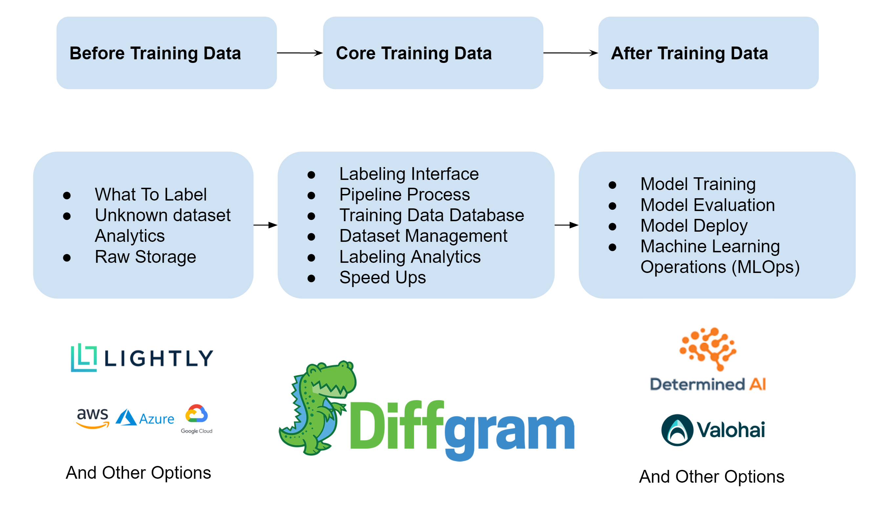

# Diffgram - Open AI Data Platform


Diffgram is annotation and training data software.

# What is Diffgram?
Diffgram is a platform for Data Annotation and Data Science.
Diffgram is one integrated system that handles most things in the new Training Data (Machine Learning) domain.
Diffgram integrates with adjacent tools.

### Who is Diffgram for?
Data Scientists, Project Admins, Software Engineers, Data Annotators and Subject Matter Experts.


### What is Diffgram a drop in replacement for?
Diffgram is a drop in replacement for the following systems: 
Labelbox, CVAT, SuperAnnotate, Label Studio (Heartex), V7 Labs (Darwin), BasicAI, SuperbAI, Kili-Technology, HastyAI, Dataloop, Keymakr.

If you see any missing features, bugs etc please report them ASAP to [diffgram/issues](https://github.com/diffgram/diffgram/issues).  See [Contribution Guide](https://diffgram.readme.io/docs/developer-contribution-guide) for more.
[More on Understanding Diffgram High Level](https://diffgram.readme.io/docs/help-im-new-what-is-diffgram-exactly)


#  Features
First, the Full Platform is Open Source. There is no trick where it "sort of works"
but you need to pay for a SaaS service to really use it.

This is the full core product.
Optional [Managed Services and Enterprise support](https://diffgram.com/enterprise).

This is an ACTIVE project. We are very open to feedback and encourage you to create [Issues](https://github.com/diffgram/diffgram/issues) and help us grow!

## User Friendly
* [NEW Import Wizard](https://medium.com/diffgram/now-anyone-can-turn-spreadsheets-into-editable-pre-labels-more-saving-hundreds-of-hours-of-bbc756ec7b49) saves you hours having to map your data.
* NEW Streamlined Annotation UI suitable both from "First Time" Subject Matter Experts, and powerful options for Professional Full Time Annotators

## Annotation
Diffgram is a fully featured annotation tool for images and video to create, update, and maintain high quality training datasets.
* [Quality Image and Video Annotation.](https://diffgram.com/software)
* [Semantic Segmentation Focus](https://diffgram.com/segmentation) Autobordering, turbo mode and more
* [Video Annotation](https://diffgram.com/video) High resolution, high frame rate, multiple sequences.
* [Speed Up with Customizable AI Userscripts](https://diffgram.readme.io/docs/userscript-examples)

Schema (Ontology): Diffgram supports all popular [attributes](https://diffgram.readme.io/docs/attributes-1) and spatial types including *[Custom Spatial types](https://diffgram.readme.io/docs/custom-spatial-templates-user-defined-shapes)*.

## Data Science
Diffgram is an amazing way to access, view, compare, and collaborate on datasets to 
create the highest quality models.

Because these features are fully integrated with the Annotation Tooling, it's absolutely seamless to go from spotting an issue, to creating a labeling campaign, updating schema, etc  to correct it. 

* Store virtually [any scale](https://diffgram.readme.io/docs/scale-store-any-scale-of-dataset-and-access-slices-instantly) of dataset and instantly access slices of the data to avoid having to download/unzip/load.
* Fast access to datasets from multiple machines. Have multiple Data Scientists working on the same data.
* [NEW Data Explorer:](https://github.com/diffgram/diffgram/pull/90#issuecomment-861014567) 
Visualize in seconds multiple datasets (Including Video!) and compare models easily without extra computation.
* Automatic [Dataset Versioning](https://diffgram.com/versioning) and user definable datasets.
* Collaborate share and comment on specific instances with a [Diffgram Permalink](https://diffgram.readme.io/docs/permalink-deep-linking).

And coming soon:
* Load streaming data from Diffgram directly into pytorch and tensorflow with one line
* Play with model parameters, and see the results in real time with Userscripts

## Workflow
Manages Annotation Workflow, Tasks, Quality Assurance and more.
* One click create [human review Pipelines](https://diffgram.com/streaming).
* Webhooks with [Actions](https://diffgram.readme.io/docs/setting-up-webhooks)
* Easily annotate a single dataset, or scale to hundreds of projects with
thousands of subdivided [task sets](https://diffgram.readme.io/docs/tasks-introduction). Includes easy search and filtering.
* Fully integrated customizable Annotation [Reporting](https://diffgram.readme.io/docs/reporting-introduction).
* Continually upgrade your data, including easily adding more depth
to existing partially annotated sets.

## Database & Software Engineering
It's a database for your training data, both metadata and access of raw BLOB data (over top of your storage choice).
* Runs on your local system or cloud. Less lag, more secure, more control. [Security and Privacy](https://diffgram.com/secure)
* Integrates with your tools and 3rd party workforces. [Integrations](#integrations)

## Tested and Stable Core
Fully integrated automatic test suite, with comprehensive [End to End](https://medium.com/diffgram/implementing-a-ci-system-with-e2e-testing-using-cypress-percy-and-circleci-246b50be466c) tests and many unit tests. 


# Quickstart

[Try Diffgram Online](https://diffgram.com/user/data_platform/new) (Hosted Service, No Setup.)

### Diffgram Dev Installer Quickstart
Requires Docker and Docker Compose
```
git clone https://github.com/diffgram/diffgram.git
cd diffgram
pip install -r requirements.txt
python install.py
# Follow the installer instruction and 
# After install:  View the Web UI at: http://localhost:8085
```
### Cloud
- [Google GCP Install Guide Compute Engine](https://medium.com/diffgram/tutorial-install-diffgram-in-google-compute-engine-134aae7d8a9b)
- [Azure AKS Kubernetes Install Guide](https://medium.com/diffgram/tutorial-installing-diffgram-on-azure-aks-b9447685e271)
- [AWS Full Kubernetes Guide](https://get.diffgram.com/kubernetes-install-guide-aws-amazon-elastic-kubernetes-service-k8s-helm-install-vpc-on-premise/)
- [Helm Chart for Kubernetes Clusters](https://github.com/diffgram/diffgram-helm)

### Other Getting Started Docs:
- [Updating Existing Installation](https://diffgram.readme.io/docs/updating-an-existing-installation)
- [Development Install Docs](https://diffgram.readme.io/docs/quickstart-installation-of-diffgram-open-core)
- [Production Install Docs](https://diffgram.readme.io/docs/open-installation-production)

# Benefits
1. Flexible deploy and many integrations - run Diffgram anywhere in the way you want.
2. Scale every aspect - from volume of data, to number of supervisors, to ML speed up approaches.
3. Fully featured - 'batteries included'.

# Docs
### [Docs](https://diffgram.readme.io/docs)
* [Getting Started Plan](https://diffgram.readme.io/docs/getting-started-plan)
* [Videos](https://www.youtube.com/channel/UC4ZVmvMA6oa3Lwaq6Si17pg/videos)
* [Cookbook (Advanced)](https://diffgram.readme.io/docs/cookbook)


# Support & Community
1. [Open an issue](https://github.com/diffgram/diffgram/issues) (Technical, bugs, etc)
2. Chat On Slack (Coming soon)
3. Forum (Coming Soon)

Security issues: Do not create a public issue. Email security@diffgram.com with the details.
[Docs](https://diffgram.readme.io/docs)

# Vision
1. Application: Support all popular media types for raw data; all popular schema, label, and attribute needs; and all annotation assist speed up approaches
2. Support all popular training data management and organizational needs
3. Integrate with all popular 3rd party applications and related offerings
4. Support modification of source code
5. Run on any hardware, any cloud, and anywhere

[Technical Direction](https://diffgram.readme.io/docs/direction)


# Speed Ups & AI
Latest AI + More
* [Examples](https://diffgram.readme.io/docs/userscript-examples)
* [Userscripts Overview](https://diffgram.readme.io/docs/userscripts-overview)


# Integrations

* [Diffgram Python SDK](https://github.com/diffgram/python-sdk)
* [Diffgram API](https://diffgram.readme.io/reference) Any language
* [AWS - Amazon Storage](https://diffgram.readme.io/docs/amazon-web-services-connection-requirements)
* [GCP Google Storage](https://diffgram.readme.io/docs/google-connection-requirements)
* Azure - Now available
* [Scale AI](https://diffgram.readme.io/docs/scale-ai)
* [Datasaur](https://diffgram.readme.io/docs/datasaur-integration)
* [Labelbox](https://diffgram.readme.io/docs/labelbox-integration)
* Submit a pull request! We want your integration here too
 


Note for initial open core release Actions Hooks are not yet available. 
Please see Diffgram.com and use them there if needed.

# Contributing
We welcome contributions! Please see our [contributing documentation](https://diffgram.readme.io/docs/contributing-guide).

# Architecture & Design Docs
We plan to release more internal architecture docs over time. Please see the [general docs](https://diffgram.readme.io/docs) in the mean time.

# Stack Example
As a loose analogy to LAMP, or MEAN stacks.
One example - use a pre-processing tool like Lightly, then do annotation in Diffgram, and model training with Determined AI. 
This is like a "LDD" stack: [lightly](https://github.com/lightly-ai/lightly) [diffgram](https://github.com/diffgram/diffgram) [determined-ai ](https://github.com/determined-ai).

You can use Diffgram with your choice of surrounding tools - the ones shown are examples and optional.
