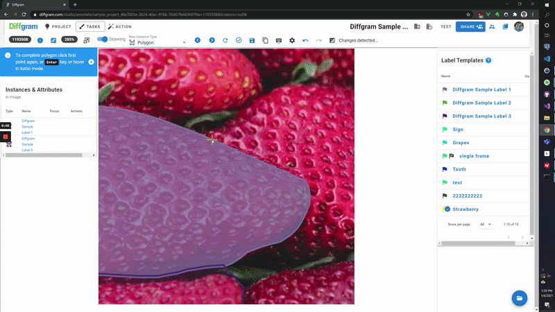
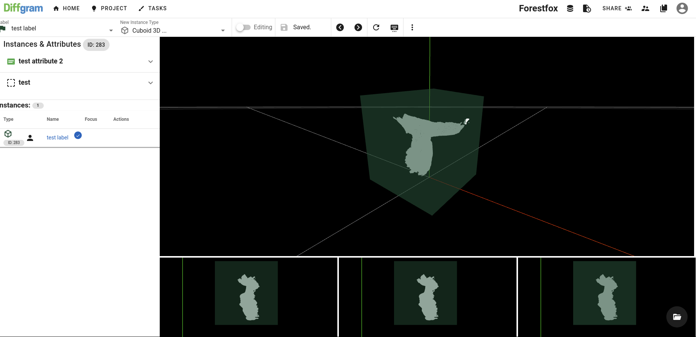
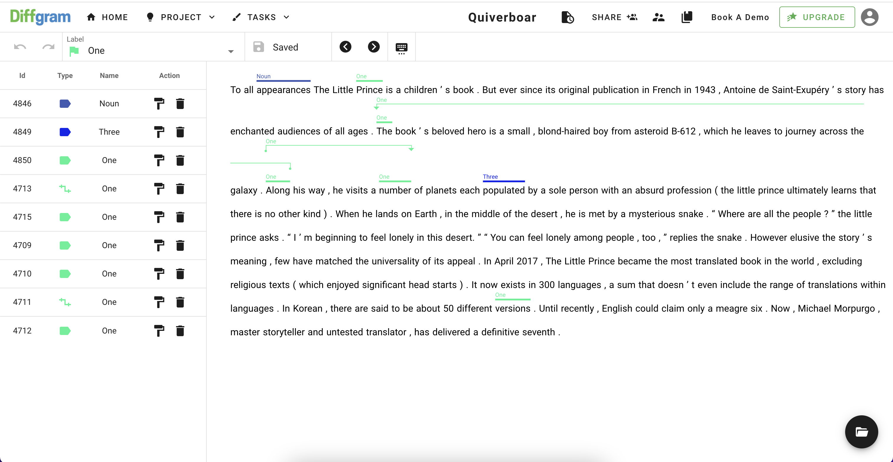
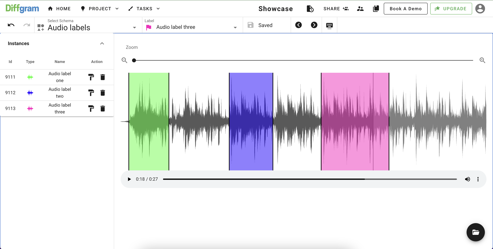
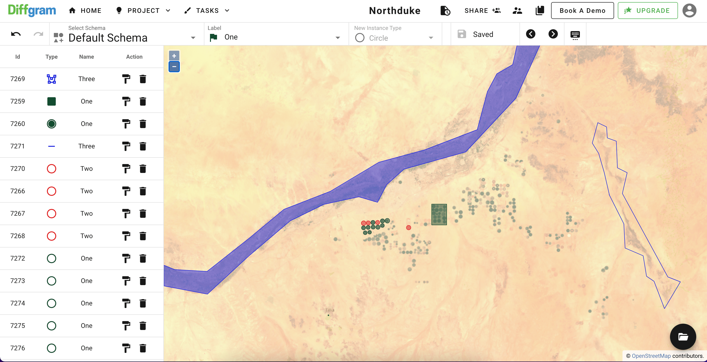

_________________

[Docs](https://diffgram.readme.io/docs)
•
[Diffgram.com](https://diffgram.com/)
•
[Join Slack Community](https://join.slack.com/t/diffgram-workspace/shared_invite/zt-twn6529v-hhSPzpQrAxvoZB95PhfAFg)

•
[Enterprise](https://diffgram.com/main/enterprise)
•
[Twitter](https://twitter.com/diffgram)

# Support & Community
1. [Open an issue](https://github.com/diffgram/diffgram/issues) (Technical, bugs, etc)
2. 😍 [Join us on slack!](https://join.slack.com/t/diffgram-workspace/shared_invite/zt-twn6529v-hhSPzpQrAxvoZB95PhfAFg)

# Open Source Training Data Platform

Modern Training Data platform for machine learning delivered as
a single application. 

Open Source Data Labeling, Workflow, Automation, Exploring, Streaming, and so much more!

Watch a high level [video explanation](https://www.youtube.com/watch?v=dws6J3bDbcU).

# Annotate Anything - Images, Video, 3D, Text, Geo, Audio And more

## Images
Box, Polygons, Lines, [Keypoints](https://diffgram.readme.io/docs/keypoints-annotation-type), Classification Tags, Quadratic Curves, Cuboids, Segmentation,  and More

## Video
Long, High Frame Rate, High Resolution Videos.

## 3D
[3D Labeling Docs](https://diffgram.readme.io/docs/3d-lidar-annotation-guide)

## Text
[Text Labeling docs](https://diffgram.readme.io/docs/text-annotation-guide)

Named Entity Recognition, Part of Speech Tagging, Coreference Resolution, Dependency Parsing

## Audio
[Audio Labeling docs](https://diffgram.readme.io/docs/audio-annotation-guide)

Annotate Audio Regions available now, 

Audios Transcription (coming soon)

## Geospatial & Tiled Imagery
Support for COG (Cloud Optimized GeoTIFF), streaming, multi-layer, standard and cloud-optimized.

Alpha Release: [Geospatial labeling docs](https://diffgram.readme.io/docs/geospatial-annotation)

## Documents

### More
Build your own UI or [contact us](https://diffgram.com/main/contact). Our intent is to build and cover all major media types in 2022, including timeseries, DICOM, and more.

# Manage all of your training data
Manage multiple Schemas, Users, Datasets, Process, and so much more. 

## Process Manager
Organize and surface your machine learning processes. 
From start, through pre-label ingestion, multiple task stages, training, and back again.
Event driven backed by AMQP (RabbitMQ).
Preview available now [Workflow](https://diffgram.readme.io/docs/workflows)
Example Actions coming June 2022.

## Customize Everything
With Diffgram you can get the exact branded experience you want through the what-you-see-is-what-you-get editor.
Whitelabel UI Layout & Branding, Automations, Schema, Geometry, Processes, Pipelines, Queries, and More.
Diffgram is the most customizable training data platform.
[Training Data Customization](https://diffgram.readme.io/docs/customization)

## Cybersecurity
How secure is your training data? [Learn more about Cybersecurity for Training Data](https://diffgram.readme.io/docs/cybersecurity-101)   
[Security Policies](https://diffgram.readme.io/docs/security-policies)

# Migration
## Labelbox to Diffgram
Are you getting great value from Labelbox? [Labelbox vs Diffgram](https://anthony-sarkis.medium.com/considering-labelbox-consider-diffgram-too-fe7a7b8ee8d7)

[One Click Migration from Labelbox](https://diffgram.readme.io/docs/1-click-migration-from-labelbox)

## Labelstudio to Diffgram
[Learn about upgrading to Diffgram](https://diffgram.com/main/best-open-source-data-labeling-2022)

## SuperAnnotate to Diffgram
[Contact us](https://diffgram.com/main/contact) to request prioritization of the automatic migration.

# What is Training Data?
Training Data is the art of supervising machines through data. This includes the activities of annotation, which produces structured data; ready to be consumed by a machine learning model. Annotation is required because raw media is considered to be unstructured and not usable without it. That’s why training data is required for many modern machine learning use cases including computer vision, natural language processing and speech recognition.

# What is Diffgram?
Diffgram is multiple training data tools in one single application.
[What is Diffgram](https://diffgram.readme.io/docs/what-is-diffgram)

Diffgram is Open Source and optionally Client Installed. **[Quickstart](#Quickstart)**

* [Who is Diffgram for?](#Who-is-Diffgram-for)
* [Why Diffgram?](#Why-Diffgram)
* [What are Diffgram's competitive advantages?](#What-are-Diffgrams-competitive-advantages)
* [Roadmap](https://diffgram.readme.io/docs/roadmap)
* [Features](#Features)
* [Standard Features](#Standard-Features)
* [Built for Scale](https://diffgram.readme.io/docs/scale)

### Who is Diffgram for?
Data Engineers, Machine Learning Leaders, AI Experts, Software Engineers, Data Scientists, 
Data Annotators and Subject Matter Experts.

### New to Training Data?
Learn more about the general concepts with the [Training Data Book](https://www.oreilly.com/library/view/training-data-for/9781492094517/).

### Why Diffgram?
Diffgram brings the functions of a complex 
toolchain directly into one application. Providing multiple tools 
with one single integrated application.

Enterprise Questions? Please [contact us](https://diffgram.com/contact).

Security issues: Do not create a public issue. Email security@diffgram.com with the details.
[Docs](https://diffgram.readme.io/docs)

# Online Playground
[Try Diffgram Online](https://diffgram.com/user/data_platform/new) (Hosted Service, No Setup.)

# Install
### [Install Diffgram](https://diffgram.readme.io/docs/install)

- [Updating Existing Installation](https://diffgram.readme.io/docs/updating-an-existing-installation)
- [Development Install Docs](https://diffgram.readme.io/docs/quickstart-installation-of-diffgram-open-core)
- [Production Install Docs](https://diffgram.readme.io/docs/open-installation-production)

Read also our [Docker compose commands cheat-sheet](https://diffgram.readme.io/docs/open-core-docker-install-cheatsheet)

## Bugs and Issues
If you see any missing features, bugs etc please report them 
ASAP to [diffgram/issues](https://github.com/diffgram/diffgram/issues). 

## Contributing 
See [Contribution Guide](https://diffgram.readme.io/docs/developer-contribution-guide) for more.
[More on Understanding Diffgram High Level](https://diffgram.readme.io/docs/help-im-new-what-is-diffgram-exactly)

### Cloud

Full support for Amazon AWS, Google Cloud, Microsoft Azure, and MinIO.

Run Diffgram on and access data from any of the clouds.

- [MinIO](https://diffgram.readme.io/docs/minio)
- [Google GCP Install Guide Compute Engine](https://medium.com/diffgram/tutorial-install-diffgram-in-google-compute-engine-134aae7d8a9b)
- [Azure AKS Kubernetes Install Guide](https://medium.com/diffgram/tutorial-installing-diffgram-on-azure-aks-b9447685e271)
- [AWS Full Kubernetes Guide](https://get.diffgram.com/kubernetes-install-guide-aws-amazon-elastic-kubernetes-service-k8s-helm-install-vpc-on-premise/)
- [Helm Chart for Kubernetes Clusters](https://github.com/diffgram/diffgram-helm)

### What is Diffgram a drop in replacement for?
Diffgram is a drop in replacement for the following systems: 
Labelbox, CVAT, SuperAnnotate, Label Studio (Heartex), 
V7 Labs (Darwin), BasicAI, SuperbAI, Kili-Technology, Cord, HastyAI, Dataloop, Keymakr, Scale Nucleus.

Please see the roadmap and talk with us if you see a missing feature.

### How much does this cost? What's your business model?
[Compare Diffgram Versions](https://diffgram.readme.io/docs/diffgram-versions-open-source-premium-enterprise)

### Premium Support
[Learn more.](https://diffgram.readme.io/docs/diffgram-versions-open-source-premium-enterprise#premium-licenses-with-open-source)

### Enterprise
[Enterprise Edition](https://diffgram.com/main/enterprise).

#  Features
This is an ACTIVE project. We are very open to feedback and encourage you to create [Issues](https://github.com/diffgram/diffgram/issues) and help us grow!

## User Friendly
* NEW Streamlined Annotation UI suitable both from "First Time" Subject Matter Experts, and powerful options for Professional Full Time Annotators

## Standard Features
* Many User Labeling - Designed for many users from Day 1.
* Scale to Mega Projects with sophisticated organizational concepts.
* Fully configurable - customize labels, attributes, and more.

## Ingest
Ingest prediction data without writing extra scripts.

* [NEW Import Wizard](https://medium.com/diffgram/now-anyone-can-turn-spreadsheets-into-editable-pre-labels-more-saving-hundreds-of-hours-of-bbc756ec7b49) saves you hours having to map your data (pre-labels, QA, debug etc.).
* [All-Cloud Integrated File Browser](https://www.youtube.com/watch?v=w7yiW5wpnMg&t=59s)
* Scalable pipeline for massive ingestion - we have tested to 600+ hardware nodes
* Integrated pipeline hooks - newly added data auto creates tasks and more

## Store
Collaboration across teams between machine learning, product, ops, managers, and more.

* Store virtually [any scale](https://diffgram.readme.io/docs/scale) of dataset and instantly access slices of the data to avoid having to download/unzip/load.
* Fast access to datasets from multiple machines. Have multiple Data Scientists working on the same data.
* Integrates with your tools and 3rd party workforces. [Integrations](#integrations)
It's a database for your training data, both metadata and access of raw BLOB data (over top of your storage choice).

## QA & Human Tasks
Manage Annotation Workflow, Tasks, Quality Assurance and more.
Task features can be used as modules within [Workflow](https://diffgram.readme.io/docs/workflows)

QA Features including:

* QA Slideshow: Reduce Costly Errors
* Reduce Context Switching Costs with Discussions & Issue Tracking
* Get New Team Members Certified with Training and Exams
* Hold People Accountable with Per User Reporting
* Reduce Human Errors with Human Centered Tasks

Learn more -> [Quality Assurance Features](https://diffgram.readme.io/docs/measure-data-quality-annotations-more)

* Automatic Per Task Review Routing, with configurable review chance
* [Human Task Pipelines](https://diffgram.com/streaming).
* Webhooks with [Actions](https://diffgram.readme.io/docs/setting-up-webhooks)
* Easily annotate a single dataset, or scale to hundreds of projects with
thousands of subdivided [task sets](https://diffgram.readme.io/docs/tasks-introduction). Includes easy search and filtering.
* Fully integrated customizable Annotation [Reporting](https://diffgram.readme.io/docs/reporting-introduction).
* Continually upgrade your data, including easily adding more depth
to existing partially annotated sets.

## Annotation
[Annotation Docs](https://diffgram.readme.io/docs/annotation)

Schema (Ontology): Diffgram supports all popular [attributes](https://diffgram.readme.io/docs/attributes-1) and spatial types including *[Custom Spatial types](https://diffgram.readme.io/docs/custom-spatial-templates-user-defined-shapes)*.
(Best Data Annotation for AI/ML)

## Annotation Automation
Run models instantly with [Javascript](https://diffgram.readme.io/docs/userscripts-overview) or make API calls to any language of your choice.
* [Automation Examples](https://diffgram.readme.io/docs/userscript-examples)
* [Build your own interactions](https://diffgram.readme.io/docs/interactions)
* Play with model parameters, and see the results in real time (Coming Soon)

General purpose automation language, solve [any annotation automation](https://diffgram.readme.io/docs/userscripts-overview) challenge.
Less annotation and automation costs.

## Stream to Training
* NEW - [Stream Training Data is Now Available](https://medium.com/diffgram/stream-training-data-to-your-models-with-diffgram-f0f25f6688c5).
* [Colab Notebook Example](https://colab.research.google.com/drive/1mW9AXnx1Ywuz_f090x0NLJDxlniKygSk?authuser=1#scrollTo=dzoSS_W0EqgW) || [Docs](https://diffgram.readme.io/docs/datasets#data-streaming-concepts) 
* [Pytorch](https://diffgram.readme.io/docs/sdk-dataset-to_tensorflow)
||  [Tensorflow](https://diffgram.readme.io/docs/sdk-dataset-to_tensorflow)

Easier and faster for data science. Less compute cost. More privacy controls. 
Load streaming data from Diffgram directly into pytorch and tensorflow with one line (alpha release live!)

## Explore
Skip downloading and unzipping massive datasets. Explore data instantly through the browser.  
* [NEW Data Explorer:](https://medium.com/diffgram/debug-the-humans-querying-your-training-datasets-with-diffgram-595447194ad) 
Visualize in seconds multiple datasets (Including Video!) and compare models easily without extra computation. [Try it now](https://diffgram.com/studio/annotate/coco-dataset) (click Dataset Explorer)
* Automatic [Dataset Versioning](https://diffgram.com/versioning) and user definable datasets.
* Collaborate share and comment on specific instances with a [Diffgram Permalink](https://diffgram.readme.io/docs/permalink-deep-linking).

## Debug
Use your models to debug the human. Visually see errors.

Diffgram is an amazing way to access, view, compare, and collaborate on datasets to 
create the highest quality models. Because these features are fully integrated with the Annotation Tooling, it's absolutely seamless to go from spotting an issue, to creating a labeling campaign, updating schema, etc  to correct it. 
* Uncover bad data and edge cases
* Curate data and send for labeling with one click
* Automatic error highlighting (Coming Soon)

## Secure and Private
* Runs on your local system or cloud. Less lag, more secure, more control.
* Enforce PII & RBAC automatically across life-cycle of
 training data from ingest to dataset to model predictions and back again

## Tested and Stable Core
Fully integrated automatic test suite, with comprehensive [End to End](https://medium.com/diffgram/implementing-a-ci-system-with-e2e-testing-using-cypress-percy-and-circleci-246b50be466c) tests and many unit tests. 

## Flexible & Scaleable 
1. Flexible deploy and many integrations - run Diffgram anywhere in the way you want.
2. Scale every aspect - from volume of data, to number of supervisors, to ML speed up approaches.
3. Fully featured - 'batteries included'.

# Docs
### [Docs](https://diffgram.readme.io/docs)
* [Getting Started Plan](https://diffgram.readme.io/docs/getting-started-plan)
* [Videos](https://www.youtube.com/channel/UC4ZVmvMA6oa3Lwaq6Si17pg/videos)
* [Cookbook (Advanced)](https://diffgram.readme.io/docs/cookbook)

# Vision
[Vision](https://diffgram.readme.io/docs/vision)

# Speed Ups & AI
Latest AI + More
* [Examples](https://diffgram.readme.io/docs/userscript-examples)
* [Userscripts Overview](https://diffgram.readme.io/docs/userscripts-overview)
* Workflow

# Ecosystem
[Ecosystem](https://diffgram.readme.io/docs/ecosystem)

# Contributing
We welcome contributions! Please see our [contributing documentation](https://diffgram.readme.io/docs/contributing-guide).

# Architecture & Design Docs
We plan to release more internal architecture docs over time. Please see the [general docs](https://diffgram.readme.io/docs) in the mean time.

