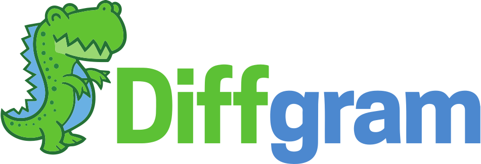
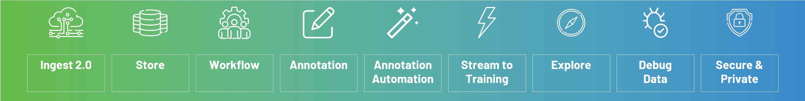
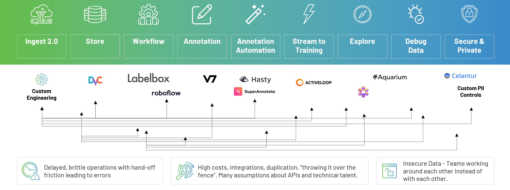
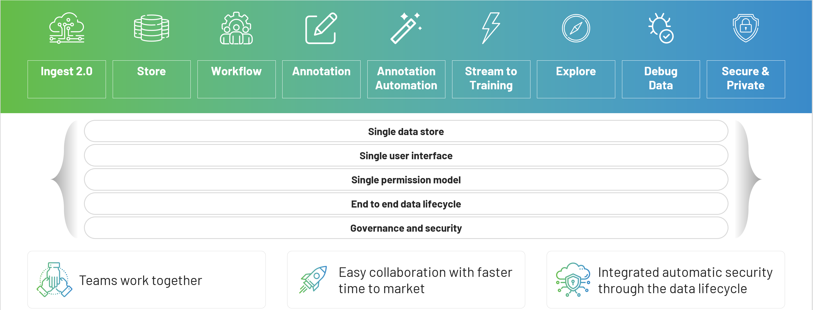
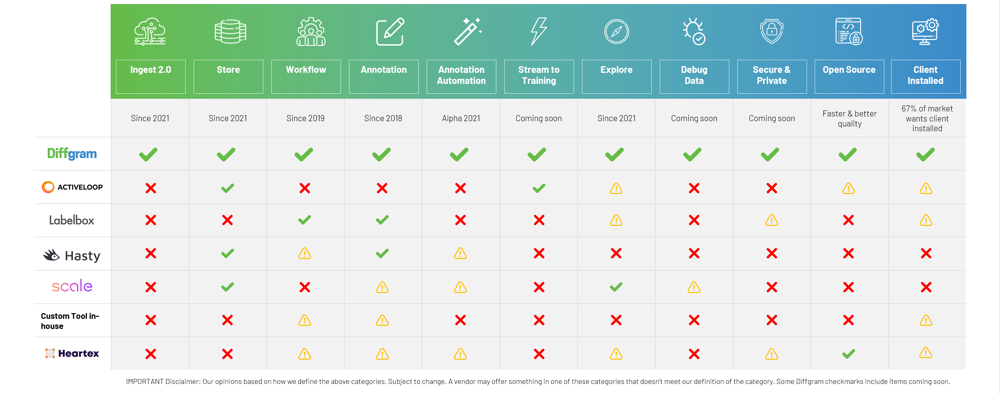
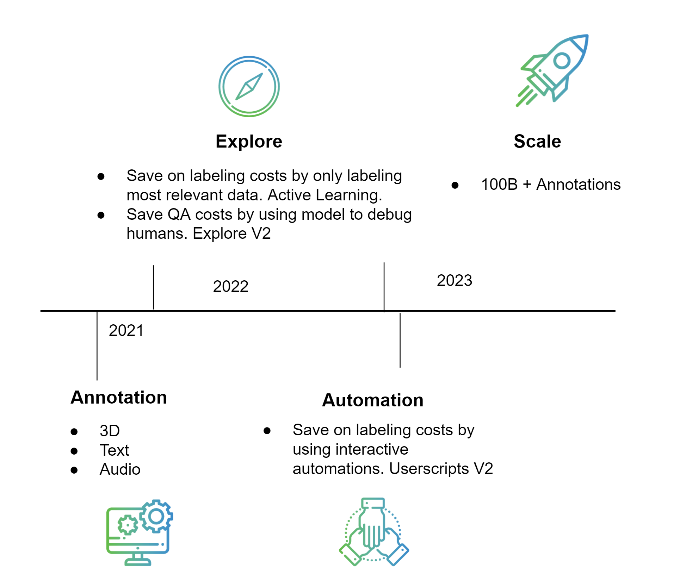

_________________

[Docs](https://diffgram.readme.io/docs)
•
[Diffgram.com](https://diffgram.com/)
•
[Join Slack Community](https://join.slack.com/t/diffgram-workspace/shared_invite/zt-twn6529v-hhSPzpQrAxvoZB95PhfAFg)

•
[Enterprise](https://diffgram.com/enterprise)
•
[Twitter](https://twitter.com/diffgram)


# Training Data Platform in One Application



Complete training data platform for machine learning delivered as
a single application. 

Open Source Data Labeling, Workflow, Automation, Exploring, Streaming, and so much more!


# What is Diffgram?
Diffgram is multiple training data tools in one single application.
1. [Ingest](#Ingest) - Magic Wizard
2. [Store](#Store) - Source of Truth for Training Data
3. [Workflow](#Workflow) - Human Tasks
4. [Annotation](#Annotation) - Image, Video, [3D Labeling](https://diffgram.readme.io/docs/3d-lidar-annotation-guide) Available Now. Plus Text & Audio Coming Soon.
5. [Annotation Automation](#Annotation-Automation) - Customizable
6. [Stream to Training](#Stream-to-Training) - Direct to PyTorch & Tensorflow Memory
7. [Explore](#Explore) - Query & Visually See Annotations
8. [Debug](#Debug) - Compare Models & More
9. [Secure and Private](#Secure-and-Private)

Diffgram is Open Source and optionally Client Installed. **[Quickstart](#Quickstart)**

* [Who is Diffgram for?](#Who-is-Diffgram-for)
* [What problem does Diffgram solve?](#What-problem-does-Diffgram-solve)
* [Why Diffgram?](#Why-Diffgram)
* [What are Diffgram's competitive advantages?](#What-are-Diffgrams-competitive-advantages)
* [Roadmap](#Roadmap)
* [Features](#Features)
* [Standard Features](#Standard-Features)
* [Built for Extreme Scale](#Built-for-Extreme-Scale)

### Who is Diffgram for?
Data Scientists, Machine Learning Leaders, AI Experts, Software Engineers, 
Data Annotators and Subject Matter Experts.

### What can I Customize?
With Diffgram you can get the exact branded experience you want through the what-you-see-is-what-you-get editor.
Whitelabel UI Layout & Branding, Automations, Label Schema, Spatial Types, Piplines, Queries, and More.
Diffgram is the most customizable training data platform.
[Training Data Customization](https://diffgram.readme.io/docs/customization)

### What problem does Diffgram solve?
The current state of multiple tools is a huge pain. 
Integrating these complex toolchains, context switching, human training, 
costs for multiple applications all add up. 



### Why Diffgram?
Diffgram solves this by bringing all the functions of a complex 
toolchain directly into one application. Providing multiple tools 
with one single integrated application.



### What are Diffgram’s competitive advantages?
One single Application with all the features you require.


[Disclaimer](#Comparison-Disclaimer)

Enterprise Questions? Please [contact us](https://diffgram.com/contact).


# Support & Community
1. [Open an issue](https://github.com/diffgram/diffgram/issues) (Technical, bugs, etc)
2. 😍 [Join us on slack!](https://join.slack.com/t/diffgram-workspace/shared_invite/zt-twn6529v-hhSPzpQrAxvoZB95PhfAFg)
3. Forum (Coming Soon)

Security issues: Do not create a public issue. Email security@diffgram.com with the details.
[Docs](https://diffgram.readme.io/docs)

# Quickstart

[Try Diffgram Online](https://diffgram.com/user/data_platform/new) (Hosted Service, No Setup.)

### Diffgram Dev Installer Quickstart
Install with Docker and Docker Compose
```
git clone https://github.com/diffgram/diffgram.git
cd diffgram
pip install -r requirements.txt
python install.py
# Follow the installer instruction and 
# After install:  View the Web UI at: http://localhost:8085
```
Read also our [Docker compose commands cheat-sheet](https://diffgram.readme.io/docs/open-core-docker-install-cheatsheet)

## Bugs and Issues
If you see any missing features, bugs etc please report them 
ASAP to [diffgram/issues](https://github.com/diffgram/diffgram/issues). 

## Contributing 
See [Contribution Guide](https://diffgram.readme.io/docs/developer-contribution-guide) for more.
[More on Understanding Diffgram High Level](https://diffgram.readme.io/docs/help-im-new-what-is-diffgram-exactly)

### Cloud


Full support for Amazon AWS, Google Cloud, and Microsoft Azure.

Run Diffgram on and access data from any of the clouds.

- [Google GCP Install Guide Compute Engine](https://medium.com/diffgram/tutorial-install-diffgram-in-google-compute-engine-134aae7d8a9b)
- [Azure AKS Kubernetes Install Guide](https://medium.com/diffgram/tutorial-installing-diffgram-on-azure-aks-b9447685e271)
- [AWS Full Kubernetes Guide](https://get.diffgram.com/kubernetes-install-guide-aws-amazon-elastic-kubernetes-service-k8s-helm-install-vpc-on-premise/)
- [Helm Chart for Kubernetes Clusters](https://github.com/diffgram/diffgram-helm)

### Other Getting Started Docs:
- [Updating Existing Installation](https://diffgram.readme.io/docs/updating-an-existing-installation)
- [Development Install Docs](https://diffgram.readme.io/docs/quickstart-installation-of-diffgram-open-core)
- [Production Install Docs](https://diffgram.readme.io/docs/open-installation-production)

### What is Diffgram a drop in replacement for?
Diffgram is a drop in replacement for the following systems: 
Labelbox, CVAT, SuperAnnotate, Label Studio (Heartex), 
V7 Labs (Darwin), BasicAI, SuperbAI, Kili-Technology, Cord, HastyAI, Dataloop, Keymakr, Scale Nucleus.

Please see the roadmap and talk with us if you see a missing feature.

### How much does this cost? What's your business model?
If you have less than 20 people and manage your own Diffgram instance there is **no licensing cost**. 
You can install Diffgram and use it with hundreds of thousands of annotations for free.

For more detail [Compare Diffgram Verisons](https://diffgram.readme.io/docs/diffgram-versions-open-source-premium-enterprise)

### Premium Support
[Learn more.](https://diffgram.readme.io/docs/diffgram-versions-open-source-premium-enterprise#premium-licenses-with-open-source)

### Enterprise
[Enterprise Edition](https://diffgram.com/enterprise).
For companies and teams with 20+ users.
This is our best level of support, Enterprise focused features, SLAs, and More.

If you are planning to do millions, billions, or even a trillion+ annotations then Diffgram Enterprise is for you! 
Diffgram Enterprise can help you scale every aspect of your training data. 

## Roadmap
2022: 
1. New Interfaces: Text, Audio
2. Save on labeling costs by only labeling most relevant data. Active Learning.
3. Save QA costs by using model to debug humans. Explore V2
4. Save on labeling costs by using interactive automations. Userscripts V2
5. Scale: Support for up to 1,000+ QPS and up to 10 Billion annotations per install.

2023:
1. Scale: Support for up to 10,000+ QPS and up to 500+ Billion annotations.


We welcome you to create issues, join our slack channel, and help shape our roadmap.
Are you an Enterprise customer? Talk to us about priority implementations.


## Built for Extreme Scale
Diffgram has many great features no matter the volume of annotation. 
Diffgram is unique in that we think about scale across all aspects of the system.

Do *any* of these apply to you?
* Models running in staging or production?
* Are using pre-labels or interactive automations?
* Need versioning?
* Have expanding use cases or need better model performance?
* Expanding your annotation team or needs? Have multiple teams accessing training data?
* Using complex data types like video, 3D, multi-modal?

These things all stack to make for 10, 100, 1000x+ increases in volumes of annotation needs.

A *single* Diffgram install is capable of 100,000,000+ (100 Million+) annotations. We plan to scale it to support 10,000,000,000 (10 Billion+) *per install*
in 2022. [More on Scale](https://diffgram.readme.io/docs/scale-store-any-scale-of-dataset-and-access-slices-instantly)

Examples of things we think about for you that go beyond the literal numbers:
* Is this cost effective at scale? If you need an automation to produce millions of instances, how can we do that in a way that approaches $0?
* What does access time for data look like when the volume is 10x 100x 1000x+?
* What does the annotator experience look like if the system is at max ingestion capacity?
* How does a new team get data in and out of Diffgram in an easy standard process?
* How can teams access data across Diffgram installations? How can we serve multiple team’s needs through one unified data model?

If you need extreme scale - choose Diffgram.


#  Features
This is an ACTIVE project. We are very open to feedback and encourage you to create [Issues](https://github.com/diffgram/diffgram/issues) and help us grow!

## User Friendly
* NEW Streamlined Annotation UI suitable both from "First Time" Subject Matter Experts, and powerful options for Professional Full Time Annotators

## Standard Features
* Many User Labeling - Designed for many users from Day 1.
* Scale to Mega Projects with sophisticated organizational concepts.
* Fully configurable - customize labels, attributes, and more.

## Ingest
Ingest prediction data without writing extra scripts.

* [NEW Import Wizard](https://medium.com/diffgram/now-anyone-can-turn-spreadsheets-into-editable-pre-labels-more-saving-hundreds-of-hours-of-bbc756ec7b49) saves you hours having to map your data (pre-labels, QA, debug etc.).
* [All-Cloud Integrated File Browser](https://www.youtube.com/watch?v=w7yiW5wpnMg&t=59s)
* Scalable pipeline for massive ingestion - we have tested to 600+ hardware nodes
* Integrated pipeline hooks - newly added data auto creates tasks and more

## Store
Collaboration across teams between machine learning, product, ops, managers, and more.

* Store virtually [any scale](https://diffgram.readme.io/docs/scale-store-any-scale-of-dataset-and-access-slices-instantly) of dataset and instantly access slices of the data to avoid having to download/unzip/load.
* Fast access to datasets from multiple machines. Have multiple Data Scientists working on the same data.
* Integrates with your tools and 3rd party workforces. [Integrations](#integrations)
It's a database for your training data, both metadata and access of raw BLOB data (over top of your storage choice).

## Workflow
Manage Annotation Workflow, Tasks, Quality Assurance and more.

* One click create [human review Pipelines](https://diffgram.com/streaming).
* Webhooks with [Actions](https://diffgram.readme.io/docs/setting-up-webhooks)
* Easily annotate a single dataset, or scale to hundreds of projects with
thousands of subdivided [task sets](https://diffgram.readme.io/docs/tasks-introduction). Includes easy search and filtering.
* Fully integrated customizable Annotation [Reporting](https://diffgram.readme.io/docs/reporting-introduction).
* Continually upgrade your data, including easily adding more depth
to existing partially annotated sets.

## Annotation
Fully featured data annotation tool for images and video to create, update, and maintain high quality training datasets.
* [Image and Video Annotation.](https://diffgram.com/software)
* [Semantic Segmentation Focus](https://diffgram.com/segmentation) Autobordering, turbo mode and more
* [Video Annotation](https://diffgram.com/video) High resolution, high frame rate, multiple sequences.
* [3D Annotation (e.g. LiDAR)](https://diffgram.readme.io/docs/3d-lidar-annotation-guide)

Schema (Ontology): Diffgram supports all popular [attributes](https://diffgram.readme.io/docs/attributes-1) and spatial types including *[Custom Spatial types](https://diffgram.readme.io/docs/custom-spatial-templates-user-defined-shapes)*.
(Best Data Annotation for AI/ML)

## Annotation Automation
Run models instantly with [Javascript](https://diffgram.readme.io/docs/userscripts-overview) or make API calls to any language of your choice.
* [Automation Examples](https://diffgram.readme.io/docs/userscript-examples)
* [Build your own interactions](https://diffgram.readme.io/docs/interactions)
* Play with model parameters, and see the results in real time (Coming Soon)

General purpose automation language, solve [any annotation automation](https://diffgram.readme.io/docs/userscripts-overview) challenge.
Less annotation and automation costs.

## Stream to Training
* NEW - [Stream Training Data is Now Available](https://medium.com/diffgram/stream-training-data-to-your-models-with-diffgram-f0f25f6688c5).
* [Colab Notebook Example](https://colab.research.google.com/drive/1mW9AXnx1Ywuz_f090x0NLJDxlniKygSk?authuser=1#scrollTo=dzoSS_W0EqgW) || [Docs](https://diffgram.readme.io/docs/datasets#data-streaming-concepts) 
* [Pytorch](https://diffgram.readme.io/docs/sdk-dataset-to_tensorflow)
||  [Tensorflow](https://diffgram.readme.io/docs/sdk-dataset-to_tensorflow)

Easier and faster for data science. Less compute cost. More privacy controls. 
Load streaming data from Diffgram directly into pytorch and tensorflow with one line (alpha release live!)

## Explore
Skip downloading and unzipping massive datasets. Explore data instantly through the browser.  
* [NEW Data Explorer:](https://medium.com/diffgram/debug-the-humans-querying-your-training-datasets-with-diffgram-595447194ad) 
Visualize in seconds multiple datasets (Including Video!) and compare models easily without extra computation. [Try it now](https://diffgram.com/studio/annotate/coco-dataset) (click Dataset Explorer)
* Automatic [Dataset Versioning](https://diffgram.com/versioning) and user definable datasets.
* Collaborate share and comment on specific instances with a [Diffgram Permalink](https://diffgram.readme.io/docs/permalink-deep-linking).

## Debug
Use your models to debug the human. Visually see errors.

Diffgram is an amazing way to access, view, compare, and collaborate on datasets to 
create the highest quality models. Because these features are fully integrated with the Annotation Tooling, it's absolutely seamless to go from spotting an issue, to creating a labeling campaign, updating schema, etc  to correct it. 
* Uncover bad data and edge cases
* Curate data and send for labeling with one click
* Automatic error highlighting (Coming Soon)

## Secure and Private
* Runs on your local system or cloud. Less lag, more secure, more control. [Security and Privacy](https://diffgram.com/secure)
* Enforce PII & RBAC automatically across life-cycle of
 training data from ingest to dataset to model predictions and back again (Coming Soon)


## Tested and Stable Core
Fully integrated automatic test suite, with comprehensive [End to End](https://medium.com/diffgram/implementing-a-ci-system-with-e2e-testing-using-cypress-percy-and-circleci-246b50be466c) tests and many unit tests. 


## Flexible & Scaleable 
1. Flexible deploy and many integrations - run Diffgram anywhere in the way you want.
2. Scale every aspect - from volume of data, to number of supervisors, to ML speed up approaches.
3. Fully featured - 'batteries included'.

# Docs
### [Docs](https://diffgram.readme.io/docs)
* [Getting Started Plan](https://diffgram.readme.io/docs/getting-started-plan)
* [Videos](https://www.youtube.com/channel/UC4ZVmvMA6oa3Lwaq6Si17pg/videos)
* [Cookbook (Advanced)](https://diffgram.readme.io/docs/cookbook)


# Vision
1. Application: Support all popular media types for raw data; all popular schema, label, and attribute needs; and all annotation assist speed up approaches
2. Support all popular training data management and organizational needs
3. Integrate with all popular 3rd party applications and related offerings
4. Support modification of source code
5. Run on any hardware, any cloud, and anywhere

[Technical Direction - Long Term](https://diffgram.readme.io/docs/direction)


# Speed Ups & AI
Latest AI + More
* [Examples](https://diffgram.readme.io/docs/userscript-examples)
* [Userscripts Overview](https://diffgram.readme.io/docs/userscripts-overview)


# Integrations

* [Diffgram Python SDK](https://github.com/diffgram/python-sdk)
* [Diffgram API](https://diffgram.readme.io/reference) Any language
* [AWS - Amazon Storage](https://diffgram.readme.io/docs/amazon-web-services-connection-requirements)
* [GCP Google Storage](https://diffgram.readme.io/docs/google-connection-requirements)
* Azure - Now available
* [Scale AI](https://diffgram.readme.io/docs/scale-ai)
* [Datasaur](https://diffgram.readme.io/docs/datasaur-integration)
* [Labelbox](https://diffgram.readme.io/docs/labelbox-integration)
* Submit a pull request! We want your integration here too
 


Note for initial open core release Actions Hooks are not yet available. 
Please see Diffgram.com and use them there if needed.

# Contributing
We welcome contributions! Please see our [contributing documentation](https://diffgram.readme.io/docs/contributing-guide).

# Architecture & Design Docs
We plan to release more internal architecture docs over time. Please see the [general docs](https://diffgram.readme.io/docs) in the mean time.


##### Comparison Disclaimer
IMPORTANT Disclaimer: Our opinions based on how we define the above categories. Subject to change. A vendor may offer something in one of these categories that doesn’t meet our definition of the category. Some Diffgram checkmarks include items coming soon. 
